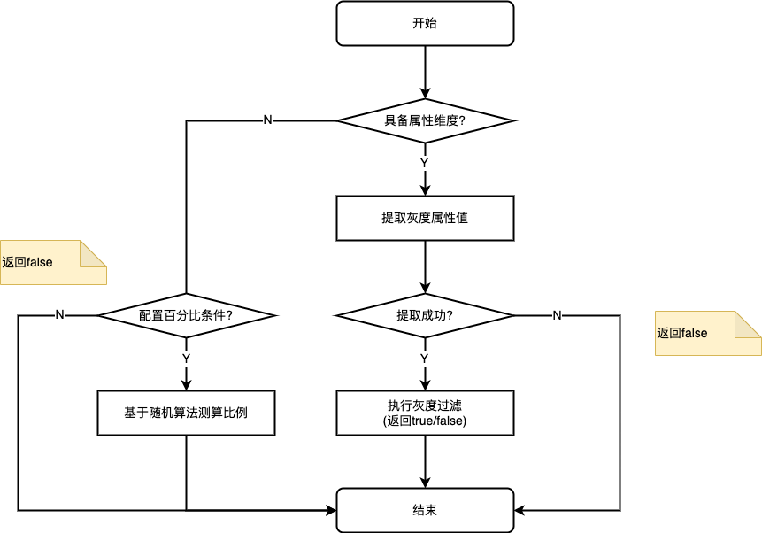

## 为什么有这个组件
当系统依赖的重要三方接口升级(切换)时, 线上一下子全切可能会有业务风险, 为解决这个问题
1. 最好是能够逐步放量, 验证ok后再放开
2. 验证不ok, 回退旧接口

尽管大多数情况下公司/团队都有全链路灰度服务(一般做在入口网关层), 全链路灰度需要上下游链路对等灰度部署, 一般通过流量染色的方式实现,
但以下场景不适用全链路灰度
1. 异步调用
2. 不具备全链路灰度条件(灰度环境配置不对等, 只有一台), 又或者不需要全链路灰度

因此需要一种业务内灰度方案, 而业务内灰度有2种场景
1. 接口灰度: 针对 http/rpc接口的灰度, 根据对结果的处理又可分为
   1. 先验证后灰度放量: 先分一部分流量新旧接口双跑, 对比验证通过后再灰度放量
   2. 无验证, 直接灰度
2. 方法灰度: 针对重构的场景, 利用线上流量辅助验证

**该组件已在生产环境业务使用, 非YY自娱自乐**

## 设计目标
1. 提供接口灰度和方法灰度功能
2. 提供可选的灰度对照(验证)功能, 默认不启用
3. 配置简单易用, 组件轻量无状态, 支持扩展

组件不支持全链路灰度

灰度的约束
1. 灰度比例有误差: 由于实际数据分布不可预测以及计算方式的原因, 灰度比例可能有一定的误差, 误差随着样本数量增大而减小, 趋近于预期值
2. 灰度计算的稳定性: 放量比例不变时, 相同维度经过多次灰度条件计算的结果(是否走灰度)一样; 放量比例减小时, 不一定

举例: 假设灰度比例从50%降到20%, 原先那30%走灰度的就不走了

## 使用方式
组件提供两种使用方式
1. 断言式: 只做条件判断, 业务代码据此决定是否走灰度逻辑
2. 代理式: 做条件判断与逻辑执行, 业务可选择性开启结果对照, 灰度组件接管常规和灰度逻辑执行, 有少量代码侵入

两种方式在灰度拆除时有区别
1. 断言式灰度拆除简单, 只需去掉灰度判断+if-else分支
2. 代理式灰度拆除需要"去代理", 将接管的逻辑还原回来(替换灰度代理)

所谓灰度拆除指的是: 灰度完成、验证稳定之后, 常规与灰度逻辑分支之间保留一个

### 组件依赖
apollo配置中心, 因本人团队实际在用apollo的缘故, 其实换成其他的配置管理也可以

### 使用步骤
1. 配置灰度规则
```
## 根据idNo灰度0.01%
gray.config.myBizKey.property=idNo
gray.config.myBizKey.rule=0.01%

## 复杂规则配置举例, 区间+列表+百分比
gray.config.myBizKey.rule=[12456, 12958]# {20001, 20002, 20003}#0.01% 
```

独立的namespace: grayscale

gray.config.{bizKey}, bizKey表示业务标识, 可自定义
1. gray.config.{bizKey}.property: 灰度属性维度, 同个bizType有且只有一个
   1. 空字符串和null都视为空, 为空时走纯粹流量灰度, 因此只有百分比规则会生效
   2. 灰度属性是一个字段, 因此要遵守java字段名语法
2. gray.config.{bizKey}.rule: 灰度规则
   1. 灰度规则不支持OR与NOT, 大部分情况下NOT可以反向转换成区间/列表
   2. 支持百分比、列表值、区间三种条件
      1. 百分比: 按比例灰度, 多个百分数只取第一个, 精确到**万分之一**
      2. 列表值: 属性值命中列表中的值即走灰度
      3. 区间: 属性值在指定范围内即走灰度
   3. 灰度条件可组合: #号分隔, 同类条件OR, 不同类的为AND
3. gray.config.{bizKey}.adopt-on-diff: 差异结果采纳策略
   1. 内置gray, regular, break三种: gray表示采用灰度结果, regular表示采用常规执行结果, break抛异常中断
   2. 自定义结果采纳的策略名不能覆盖内置的三种策略

2、断言式
1. 注入GraySupport
2. graySupport.shouldGray(String bizKey, E propertyHolder)

```java
@Autowired
private GraySupport graySupport;

public Resposne service(PropertyHolder holder) {
    if(graySupport.shouldGray("myProperty", holder) {
        //....
    } else {
		//...
    }
}
```

3、代理式
1. 继承AbstractGrayCommand, 如果需要, 重写compareOutcome方法定制比较逻辑
2. 注入Command
3. 调用command.execute(String bizKey, E propertyHolder, P request)

缺点:
1. 对代码有一定的侵入
2. 开启对照后, 同步执行常规逻辑, 增加了耗时

```java
//定义command
@Component
public class MyGrayCommand extends AbstractGrayCommand<Request, Response> {
    @Autowired
    private SomeService service;
    
    @Autowired
    public OcrGrayCommand(GrayMonitor monitor) {
        super(monitor);
    }

    @Override
    protected Response runRegularLogic(Request request) {
        //...
    }

    @Override
    protected IdentityPhotoOcrResp runGrayLogic(Request request) {
        //...
    }
}

//使用command
@Autowired
private MyGrayCommand cmd;
public Response doSth(Request request) {
	cmd.execute("myProperty", request);
}
```

4、关闭/中断灰度

将rule条件置空

### 注意事项
当属性传参类型E为基本类型(String/Integer/Long/Double/Float), 组件不会校验属性字段是否合理, 因为无法校验
只有传参是对象类型时, 会校验属性字段

## 组件设计
### 灰度设计
灰度的本质是采样+切流, 采样维度有
- 按id: 用户id, 设备id, 证件号等
- 按特征: 渠道, app os版本, 证件类型等
- 按流量
- 以上维度组合

实际的业务场景里通常为单维度, 或者单维度+百分比

采样方式有:
- 百分比采样: 比如流量的30%
- 随机采样
- 条件采样: 根据某一个维度属性过滤, 具体来说, 可分为两种
  - 等值采样: 等于(不等于)某个值, 包含在值的集合里
  - 模糊采样: 指定前缀(后缀), 大于(或小于)某些值, 包含某些数字(字符)

### 灰度断言流程



### 灰度代理流程


### 结果对照设计
流程图


常规逻辑和灰度逻辑封装成Command, 执行时try…catch包裹, 异常不影响流程, 和正常返回一样是输出的一种

对照适用场景:
1. 查询
2. 纯计算, 无数据写
3. 有数据写, 新旧逻辑写不同的数据介质、写不同数据行, 两者互不干扰

对照不适用的场景:
1. 写数据冲突: 比如灰度逻辑与常规逻辑修改同一行数据
2. 更新共享字段: 灰度逻辑与常规逻辑更新内存/redis中同一字段(flag)

对照模式的限制: 对照和常规逻辑的出入参类型必须一致

## 主要思考
1、为什么要限制一个bizType只有一个灰度属性?

因为实际的业务灰度中, 绝大多数情况都是单维度的灰度

2、灰度属性有什么限制?

不支持嵌套属性, 比如类似field1.field2的形式是不合法的

这里主要是出于简单考虑, 避免反射过程中不必要的层级处理, 实际的业务灰度中也很好规避这个问题

3、配置更新时配错了会怎样?

"软错误提示": 新配置解析异常时，自动沿用旧配置

4、为什么要用代理式灰度, 将逻辑包装成command类?
1. 提供对照功能
2. 支持方法级的灰度
3. 此外代理式灰度还提供了统一的灰度与对照的监控, 避免了boilplate

5、为什么要提供对照功能?
1. 接口升级切换灰度时需要对照新旧接口返回, 增强灰度的结果验证能力
2. 重构代码后, 新旧方法块/逻辑级别很难通过简单的单测来覆盖验证, 对照有助于这一过程

6、为什么灰度规则以及属性配置不用表达式?

没必要, 尽量保持组件简单少依赖
1. 实际的灰度条件和规则往往是相对固定的, 没有那么复杂, 表达式方案覆盖的场景是本场景的超集, 过重 
2. 使用表达式会引入附加的问题: 例如考虑表达式缓存, 避免内存泄露, 防止恶意表达式攻击等

假使真的需要定制, 那么实现GrayFilter即可

7、对属性有加工的情况如何处理? 比如取uid的后四位
1. 实现GrayFilter接口, 定制过滤器
2. 手动处理, 并将处理后的结果当作灰度属性

8、如何实现百分比过滤?

方法不止一种, 读者请自己思考, haha :)


